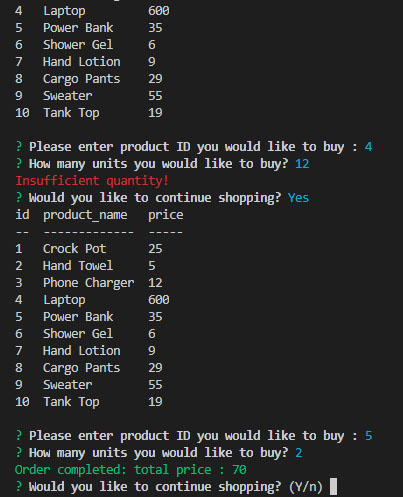
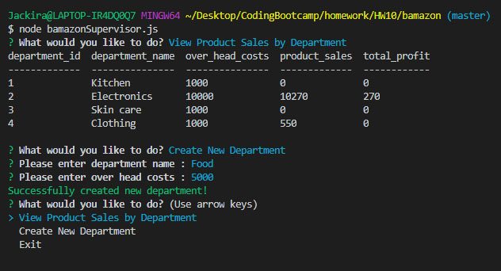

# bamazon
# TerminalWordGuess

### Overview
This is a node.js database application.   The idea is to create an Amazon-like storefront.  By connecting with MySQL, we can manage all data through the database.  Users can run this application in different roles, customer, store manager or superviser.  All functionalities in each role are different.

### How to use.
- Customer Mode (bamazonCustomer.js)
    1. The product table will be displayed once you run the program.
    2. User can enter product Id and a number of units they want to buy.
    3. Each purchase will update the database.  Please check the product after purchase to see the update.
    

- Manager Mode (bamazonManager.js)
    1. User will be giving choices in the following.
        - "View Products for Sale" - Users can view all products in detail.
        - "View Low Inventory" - Users can see any products that are low in inventory.
        - "Add to Inventory" - Users can update product inventory.
        - "Add New Product" - User can add new product into the database.
    2. Each choice will interact with database directly.
    3. After the task is done, user will be able to choose what to do again.
    

- Supervisor Mode (bamazon.Supervisor.js)
    1. User will be giving choices in the following.
        - "View Product Sales by Department" - Users can view product sale data which is grouped by department.
        - "Create New Department" - let the users create a new department for the future use.
    2. Each choice will interact with database directly.
    3. After the task is done, user will be able to choose what to do again.
    

    [VDO Demonstration](https://www.youtube.com/embed/bpGFsRDWqgE)

---

There is no deployed version of this application since this is a javascript node application running on the terminal.   You can however view , download, and try running the code from github, but you will need to create your own .env for authentication purpose.

---

### In the code...
    - We use node.js and javascript in coding.
    - Inquirer package is used to prompt the choices and data input.
    - MySQL is used for database management.
    - We use console.table to display data returned from SQL query.

### Credit
Kanwee Kiatnikorn : Design, Coding, and Testing.